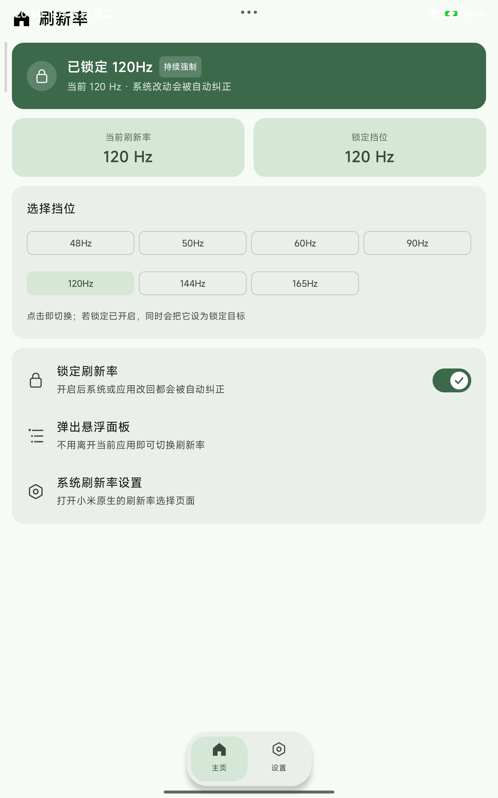

# XiaomiPadFreshRateSwitcher

在小米平板上**通过常驻通知一键切换 / 锁定屏幕刷新率**的 KernelSU 模块 + Root 应用（由 Deepseek v4.1 flash 倾心打造）。

A KernelSU module + root app that switches and locks the display refresh rate from a persistent notification, built for Xiaomi Pad on HyperOS.

* 包名 / Package: `com.dsh.refreshswitch`
* 当前版本 / Version: **4.0.1**
* UI：**MIUIX**（HyperOS 组件与配色）与 **M3E**（Material 3 Expressive / Material You）两套完全独立的界面

---

## 功能

### 刷新率切换与锁定

* 面板里直接切换所有可用挡位（本机为 48 / 50 / 60 / 90 / 120 / 144 / 165 Hz）
* 通过 `service call SurfaceFlinger 1035 i32 <modeId-1>` 切换（唯一可靠路径，需要 root）
* **刷新率锁定**：开启后系统或应用把刷新率改掉会被自动纠正（实测篡改后 1~3 秒内纠回）
* 挡位表会随系统更新漂移，因此**只持久化 fps 数值**，不持久化 modeId

### 常驻通知 / 悬浮窗

* 常驻通知显示当前刷新率 + 每个挡位一个快捷按钮
* 点击通知弹出**悬浮窗面板**（不跳转 APP），带进场/退场动画（淡入淡出 + 轻微缩放）
* 面板点空白处关闭；面板右上角可进入 APP 本体
* 可关闭常驻通知，改用 **root 守护进程**（不占用通知栏）

### 自动化（4.0 新增）

* 独立「自动化」页（主页 ↔ 自动化 ↔ 设置 三页，可左右滑动切换）
* **总开关**：关闭时下方设置全部变灰不可点
* 监测前台应用（root 读 `dumpsys activity activities`），按应用配置：打开该应用自动切到指定刷新率，退出自动恢复原值
* 每个应用一行：**图标 + 应用名 + 包名 + 当前规则**，点 `⌃⌄` 选择挡位；已配规则的应用置顶并按刷新率从高到低排列
* 应用列表通过 root 读取（`pm list packages`），可切换是否显示系统应用
* 进入 / 退出 / 修改规则都有 toast 提示（可在设置里一键关闭全部 toast）

### 界面

* **双风格**：MIUIX 与 M3E，设置页可切换
* 主页 ↔ 自动化 ↔ 设置支持**左右滑动切换**，也支持点击导航项
* 底栏样式可选：**标准（贴地）** / **悬浮底栏**（横竖屏均生效，横屏自动竖排到左侧）
* 横屏自动把导航栏移到左侧
* 状态栏 / 导航栏图标深浅色自动反色
* 系统深浅色、MIUIX 动态取色、Material You 动态取色
* 点击适配系统震动反馈

### 其他

* 自启动（HyperOS 自启动 + boot 广播 + 定时重启任务）
* 可选**隐藏桌面图标**、**隐藏后台任务**（仍可从悬浮窗进入）
* 悬浮窗权限可通过 root 直接授予

---

## 截图

| MIUIX | M3E |
|---|---|
|  |  |

---

## 安装

### 方式一：KernelSU 模块（推荐）

1. 下载 Release 里的 `XiaomiPadFreshRateSwitcher-KSU-module.zip`
2. KernelSU 管理器 → 模块 → 从本地安装 → 重启
3. 安装后自动安装 APK 并拉起服务；再次开机时 `service.sh` 会比对 APK md5，有变化则重装

### 方式二：直接安装 APK

下载 Release 里的 `RefreshSwitch.apk` 安装，打开后授予通知权限与悬浮窗权限，并在 KernelSU 中允许 root。

> 卸载模块不会自动删除已安装的 APK；`uninstall.sh` 会停服务并清理自启。

---

## 使用

* **切换刷新率**：点常驻通知 → 悬浮面板点挡位；或打开 APP 主页点挡位
* **锁定**：主页或面板里打开「锁定刷新率」，之后系统改动会被自动纠正
* **关闭通知**：设置 → 通知 → 常驻通知（关闭后自动改为 root 守护进程）

---

## 构建

需要 JDK 21、Android SDK 36、Gradle 8.14+；UI 使用 Compose（Kotlin）+ Material3 + MIUIX。

```bash
# 1) 编译 APK
cd <repo>
gradle :app:assembleRelease

# 2) 打包 KernelSU 模块（把 APK 放进 ksu-module 并压缩）
#    Windows 下可直接用 scripts/build_module.ps1
```

`scripts/` 里是作者本机使用的两个 PowerShell 脚本（`build_compose.ps1` / `build_module.ps1`），主要供参考：

* `app/build.gradle.kts` 里 `configurations.all { exclude(group = "org.jetbrains.compose.material3") }` 是为了让 Compose Multiplatform 与 AndroidX material3 并存
* MIUIX 依赖：`top.yukonga.miuix.kmp:miuix-android` 与 `miuix-icons-android`

### 关于 Material 3 Expressive


* `M3eSwitch`：M3 `Switch` + `thumbContent`（开=✓ / 关=✕）+ `SwitchDefaults.colors(...)`
* `M3eFloatingNav` / `MiuixFloatingNav`：悬浮胶囊底栏
* `AnchorPopupMenu` / `MiuixPickerRow`：单击行 → 行下方弹出选项框

---

## 目录结构

```
app/                 Compose 应用源码（Kotlin + 少量 Java 后台代码）
ksu-module/          KernelSU 模块文件（module.prop / service.sh / action.sh / uninstall.sh）
scripts/             作者本机构建脚本（PowerShell，参考用）
docs/                截图
```

---

## 已知限制

* 切换依赖 `SurfaceFlinger` 服务调用，**必须 root**（KernelSU / Magisk 均可）
* 部分 ROM 的开发者选项「显示屏幕刷新率」只在开机时读取，无法在不重启 SurfaceFlinger 的前提下实时开关（重启 SurfaceFlinger 会导致重启，本项目不做）
* 「隐藏后台任务」在部分 ROM 上仍会在最近任务里短暂出现

---

## License

MIT © 2025 XGMRXXC

---

## 更新日志

### 4.0.1

* M3E 自动化行去掉上下箭头，与设置页选项行一致；已配置规则的应用置顶并按刷新率从高到低
* MIUIX：选项框改用 Compose 自带 `DropdownMenu`（不再手绘），从最右侧弹出；整条应用行可点；展开时该行整条变灰
* M3E 选项框按手指点击位置弹出
* 应用行显示图标 + 应用名 + 包名
* 设置页新增「Toast 提示」总开关，可一键关闭全程序 toast
* MIUIX 悬浮窗的锁定开关改用 MIUIX 原生 `Switch`
* 删除主页与悬浮窗里的「进入系统设置」入口；设置页删去主题描述文本
* 修复深色模式下 M3E 文字发黑；修复 MIUIX 标题栏偏低、横屏侧栏被截断；修复 M3E 横屏侧栏与状态栏颜色不一致

### 4.0

* 新增「自动化」页：总开关 + 按应用自动切换刷新率（前台监测、规则持久化、进入/退出 toast、系统应用可见开关）

### 3.3

* 「关于」删去无用文本（去掉开发向的切换方式说明），改为署名行 **Powered by Deepseek v4.1 flash**

### 3.2

* MIUIX 标题栏改为紧凑栏 `SmallTopAppBar`，标题升到状态栏正下方（实测上移约 40dp），把空间还给内容

### 3.1

* 修复 MIUIX 横屏侧栏被顶栏截断（侧栏独立占满整列）
* 修复 M3E 横屏侧栏与状态栏颜色不一致（外层背景与侧栏同色）

### 3.0

* MIUIX 选项框：不再使用依赖 `LocalNavigationEventDispatcherOwner` 的 `SuperDropdown`（会闪退），改为自绘 MIUIX 主题弹层（按行实测高度定位 + 入场动画）
* M3E 选项框改用 Material3 原生 `DropdownMenu`
* M3E 增加底栏样式（贴地 / 悬浮），横竖屏均生效
* M3E 选项行去掉上下箭头

### 2.9

* 选项框改为锚定式（行右侧 ⌃⌄，行下方弹出，当前项高亮 + 对勾）
* 修复 MIUIX 设置页多出的分割线


### 2.7

* 主页与设置支持左右滑动切换（`HorizontalPager`）
* MIUIX 底栏样式可选（标准 / 悬浮）

### 2.6

* 悬浮窗加入进出场动画（淡入淡出 + 轻微缩放），窗口移除延后到动画结束

### 2.5

* 修复 M3E 与状态栏冲突（补 `windowInsetsPadding`）
* 两种风格都支持状态栏 / 导航栏图标反色

### 2.4

* M3E 按 KernelSU 的 Material 3 设计重做（TonalCard / ExpressiveSwitch / 悬浮胶囊底栏 / 扁平顶栏）

### 2.3

* 修复横屏 UI 串台、悬浮面板挡位换行、MIUIX 分割线、横屏左上角色块、M3E 开关样式

### 2.2 / 2.1 / 2.0

* 隐藏桌面图标 / 隐藏后台任务 / 悬浮窗内进入 APP
* 常驻通知开关、底栏分离主页与设置、MIUIX 与 M3E 双风格
